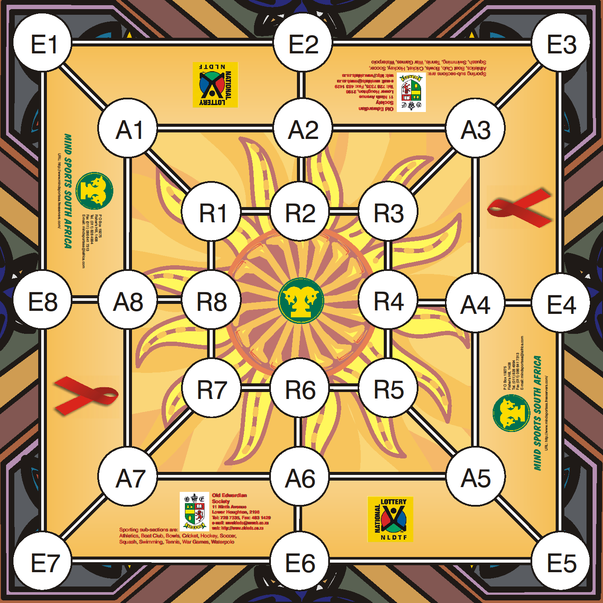

# Morabaraba

## Board

*An example of a Morabaraba board.
Source: http://esportscommentator.blogspot.com/2015/04/generally-accepted-rules-for-game-of_4.html*

* The board consists of 24 junctions
    * They may have different names
    * But their positions remain the same
    * Their connections also remain the same
* Two junctions are connected to each other via
    * Rows
    * Columns
    * Diagonals
* They form lines where three of them have the same kind of connection
    * For example, A1 Row A2 Row A3
* Each junction may be either empty or occupied by a cow
* A cow can be placed onto or removed from a junction
* The board reports whether two junctions are neighbours
* The board reports the lines that are occupied by cows of a particular
    shade - mills
* The board reports the number of cows of a given shade occupying it
* The board reports if a shade on the board has cows with free neighbours
* The mills that a junction is in are reported

## Players

* Each player has a hand of cows of single shade
* The shades may either be dark or light
* The phase of a player can be computed from their hand and board
    after a move
    * The player is placing if they have a hand
    * The player is moving if they have
        * No hand
        * More than 3 cows on the board
    * The player is flying if they have
        * No hand
        * 3 or fewer cows on the board
* The player reports the number of cows on hand

## Move

* A move may either be a
    * A placement with a single junction or
    * A movement with a source and a destination junction or
    * A concession
* A move may include a shot with it if it's a placement or a movement

## History

* The history keeps collects combinations of
    * Each move
    * The board after the move was actioned
    * The player (state) who made the move
* The history can report a particular player's previous turn
* The history can report if there has been a shot in the past ten moves

## Gameplay

* The game is initialised with
    * An empty board
    * Both dark and light players issued 12 cows
    * An empty history
* Each move must correspond with the history
    * A player may only place a cow if they are in the placing phase
    * A player may only shoot if their turn forms a new mill
    * A player may only shoot an opponent's cow that is
        * Either not in a mill OR
        * If all the opponent's cows are in mills
    * A player may only move if they are either in the moving or
        flying phases
    * A player may only move in the moving phase if the move is taking
        place on neighbouring junctions
    * A player may only move if the movement does not
        form a second most recent turn's mill that they broke in the
        most recent turn to form the most recent turn's mill that they
        will break if the move is successful
* Turns switch after every successful move with the first being the dark
* The game completes when
    * The player concedes when
        * They have less 2 or fewer cows on the board OR
        * The player cannot move
            * All the player's cows are have no empty neighbours and
            the player is in the moving phase
        * If the player chooses to concde
    * The game is called a draw when
        * If both competitors are either in moving or flying phases, and
            there has been no shot in the most recent ten moves
        * Both competitors are in the moving phase and all their cows have
        no empty neighbours

## Error Codes

* Placement expected
* Movement expected
* No new mill formed
* Shooting target in a mill
* Moving phase but movement not on neighbouring junctions
* Mill cannot be reformed
* Junction occupied
* Junction empty

## Test Categories

* Initialisation
* Placement
* Movement
* Flight
* Shooting
* Turn switching
* Error conditions
* Termination

## Input and Output

* The input is a move and history
* The output is either
    * the updated history OR
    * an error code, inputted history and the offending move
